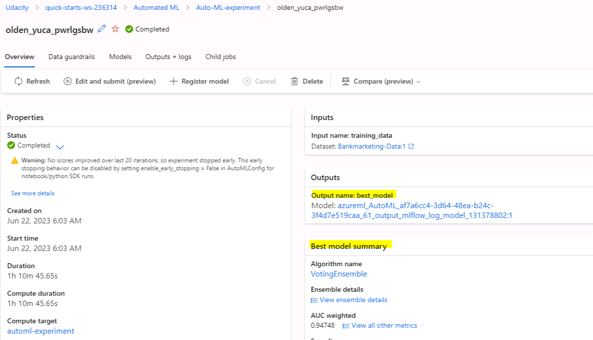

# Operationalizing Machine Learning

## Overview
This project is part of the Udacity Azure ML Nanodegree.
In this project, Azure is used to configure a cloud-based machine learning production model, deploy it, and consume it. 
Additionally a pipeline is created, published and a REST endpoint consumed.

The main steps of the project are:
1. Authentication
2. Automated ML Experiment
3. Deploy the best model
4. Enable logging
5. Swagger Documentation
6. Consume model endpoints
7. Create and publish a pipeline
8. Documentation

## Summary
This project revolves around a dataset that captures the outcomes of marketing campaigns conducted by a Portuguese banking institution. 
The campaigns were centered around phone calls, where customers were approached to subscribe to a bank term deposit. 
The aim is to leverage customer attributes such as age, job, education, default status, and balance to predict whether 
a customer will ultimately subscribe to the term deposit. A classification task is done with Azure AutoML and the best model
is deployed. Once the model is deployed, it can be consumed. Addtionally a pipeline is created, published and consumed
with Azure.

## Future work
Given the highly imbalanced nature of the dataset, alternative performance metrics such as Weighted-AUC and F1-Score can 
be utilized to evaluate the models. In cases where the Weighted-AUC or F1 score falls short of expectations, 
techniques like Undersampling, Oversampling, or SMOTE can be explored to address the class imbalance issue.

Another strategy involves tuning the hyperparameters of the Voting-Ensemble model generated through the AutoML approach. 
This includes optimizing the list of estimators, the voting method (e.g., hard or soft), and the weights assigned to 
predicted class labels or probabilities before averaging. By fine-tuning these hyperparameters, the overall performance 
and effectiveness of the Voting-Ensemble model can be enhanced.

## Automated ML Experiment
For the AutoML experiment, the following relevant dataset was uploaded to Azure to make it available. 

In the job section, we can see that the experiment is completed.

The best model is identified by the chosen primary metric and can be used for further steps.

## Model deployment
The best model is deployed.

## Enable Logging
"Application Insights" is enables in the Details tab of the endpoint.

Logs for enabling "Application Insights"

## Swagger Documentation
Swagger is running on localhost.

## Consume Model Endpoints
The interacting with the trained model is shown. The endpoint can be consumed and the JSON output from the model is
produced.

## Create, Publish and Consume a Pipeline
Bankmarketing dataset and AutoML module in pipeline.

Scheduled run in ML studio.

In Jupyter Notebook the step runs are shown with the "Use RunDetails Widget".

Pipeline has been created.

Pipeline run triggered by published pipeline REST endpoint in AzureML studio.

Pipeline endpoint is shown.

"Published pipeline overview" showing REST enpoint and status is ACTIVE.

## Screencast
A screencast with the best deployed AutoML enpoint and the sucessfull deyployed pipeline can be found here:
https://www.youtube.com/watch?v=f-72J2wYams

